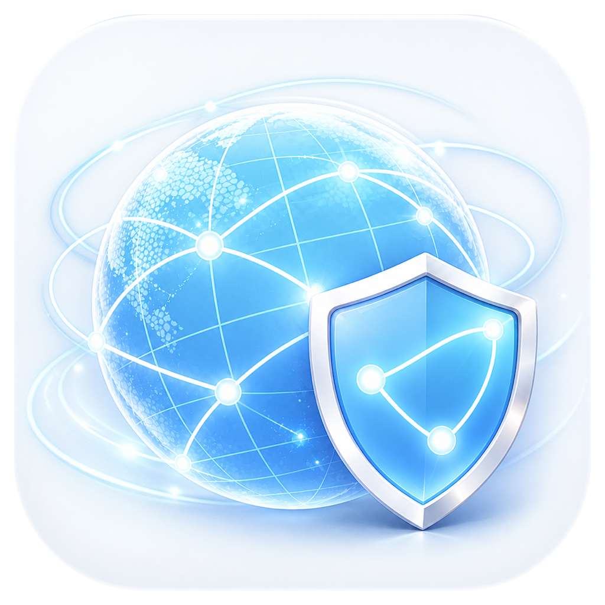

  
  <h1>网络优化器</h1>
  
<strong>面向 macOS 的 Clash Verge / Mihomo 网络诊断、地区优选与自动恢复工具</strong>

  
自动识别真实端口与订阅节点地区，在你选定的地区内持续监测、优选并恢复代理连接。

  

    
  

  

    
    
    
    
  

---

## V3.4.0 新功能

- **多地区节点分类**：自动识别日本、香港、台湾、新加坡、美国、韩国、英国、德国、法国、加拿大、澳大利亚等常见地区。
- **按地区严格筛选**：选择日本就只检测和使用日本节点；选择香港就只检测和使用香港节点，不会跨地区静默回退。
- **订阅自适应**：地区选择器只展示当前订阅实际存在的地区，每台电脑都根据自己的 Clash 配置和节点名称独立识别。
- **在线更新**：V3.4.0 起可在应用内检查 GitHub 新版本；更新包与更新清单均使用 Sparkle EdDSA 签名验证。

## 主要能力

| 能力 | 说明 |
|---|---|
| 自动环境发现 | 识别 Clash Verge Rev / Mihomo 的 Unix Socket、本机 TCP 控制接口、实时代理端口和可控策略组 |
| 节点质量优选 | 在所选地区内按成功率、可靠性、延迟、抖动和近期故障记录排序 |
| 断线自动恢复 | 双路确认故障，最多尝试三个合格候选，失败则恢复原选择链并退避 |
| Clash 自愈 | 国内网络正常但 Clash 异常时，受限地启动或重启当前用户的 Clash Verge |
| 低资源后台监测 | 网络变化即时唤醒，正常状态低频检查，并提供系统通知与原生提示音 |
| 本地网络测速 | 使用 macOS 原生 `networkQuality` 测试下载、上传、延迟和响应能力 |

## 下载与安装

### [前往 Releases 下载最新版](https://github.com/lris914/network-optimizer-updates/releases/latest)

1. 下载 `Network-Optimizer-V3.4.0-macOS-Universal-Installer.dmg`。
2. 打开 DMG，将“网络优化器”拖入“Applications（应用程序）”。
3. 覆盖旧版时，在 macOS 提示中选择“替换”。应用名称、Bundle ID 和原有设置都会保留。
4. 当前版本使用临时应用签名，没有 Apple Developer ID 公证；首次打开若被拦截，请在 Finder 中右键应用并选择“打开”。

V3.3.2 及更早版本必须手动安装一次 V3.4.0。之后可通过“设置 → 软件更新 → 立即检查更新”升级。

## 安全与隐私边界

- 只访问本机回环接口或本机 Unix Socket。
- 不读取、上传、刷新或改写代理订阅。
- 不修改 DNS、TUN、路由、规则或 macOS 系统代理。
- 不扫描局域网，不下载或替换 Mihomo 内核。
- 不选择当前所选地区以外的节点。
- 控制密钥只保存在当前用户的 macOS 钥匙串中。
- 在线更新只接受通过内置 EdDSA 公钥验证的签名清单和更新包。

## 系统要求

- macOS 13 或更高版本。
- Apple Silicon 或 Intel Mac。
- 已安装并配置 Clash Verge Rev，或其他提供标准 Mihomo 本机控制接口的客户端。

## 关于这个仓库

本仓库只公开安装包、版本说明和在线更新清单，不公开应用源代码。应用源码保存在独立的私有仓库中。

---

  网络优化器 · 多地区、低干扰、可回滚的本机网络恢复工具

